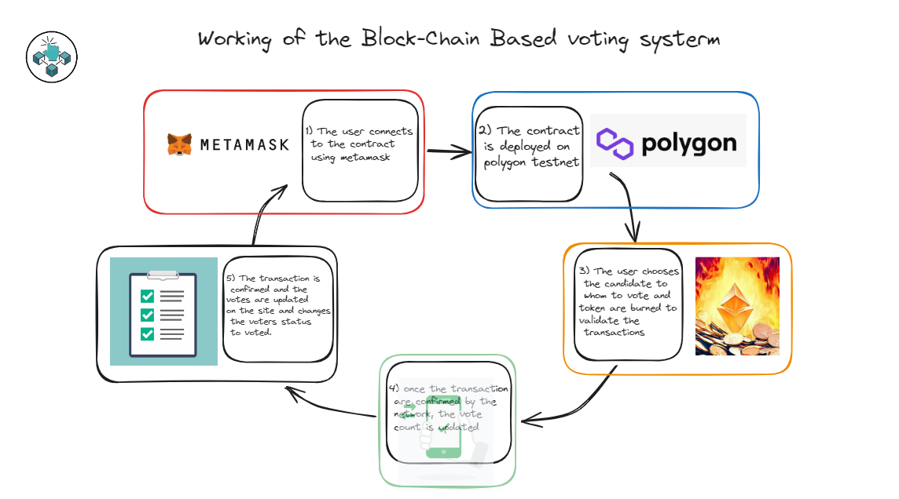

# Blockchain Voting System - CoinLocator

## Overview💜

CoinLocator is a decentralized Web3 voting, staking, and governance platform designed to enable transparent, secure, and community-driven decision-making.

The platform allows users to connect their wallets, stake tokens, participate in governance voting, and earn rewards—all powered by smart contracts on EVM-compatible blockchains.

By combining on-chain governance with DeFi incentives, CoinLocator creates a scalable ecosystem where users are rewarded for active participation while ensuring trustless and tamper-proof voting processes.

The working is as follows:


## Features🌟

- 🗳️ **Decentralized Voting**
  - Secure and transparent on-chain voting
  - Immutable results powered by smart contracts
- 💰 **Token Staking**
  - Stake tokens to participate in governance
  - Earn rewards based on staking duration and amount
- 🎁 **Incentive Mechanisms**
  - Token rewards for voting and staking
  - Promotion system for active participants
- ⚖️ **Advanced Governance Models**
  - Weighted voting
  - Ranked-choice voting
- 🔐 **Security**
  - Smart contract-based logic
  - Multi-sig wallets for enhanced security
  - Reentrancy protection

## Technologies🛠

- **Frontend**: React.js
- **Backend**: Node.js, Express.js
- **Blockchain**: Solidity (EVM-compatible networks)

## Supported Networks🌐 

- **Ethereum**
- **Binance Smart Chain**
- **Polygon**

## Getting Started🚀

### Prerequisites

Before getting started, make sure you have the following installed:

- [Node.js](https://nodejs.org/en/download/) (version 18.x or higher)
- [Git](https://git-scm.com/downloads)
- [Yarn](https://yarnpkg.com/getting-started/install)

### Installation

1. Clone the repository:

```bash
git clone https://github.com/artemus-jarrett/blockchain-voting-system.git
```

2. Install dependencies:

```bash
cd blockchain-voting-system
npm install
```

3. Start the development server:

```bash
npm start
```

4. Open [http://localhost:3000](http://localhost:3000) in your browser to view the application.

## Vision🌈

CoinLocator aims to become a modular governance layer for Web3 ecosystems, enabling projects and communities to adopt transparent decision-making systems with built-in economic incentives.

## Contributing🤝

We welcome contributions from developers, designers, and Web3 enthusiasts.
Feel free to fork the repo, open issues, and submit pull requests.

## License📜

This project is licensed under the MIT License. See the [LICENSE](LICENSE) file for more information.